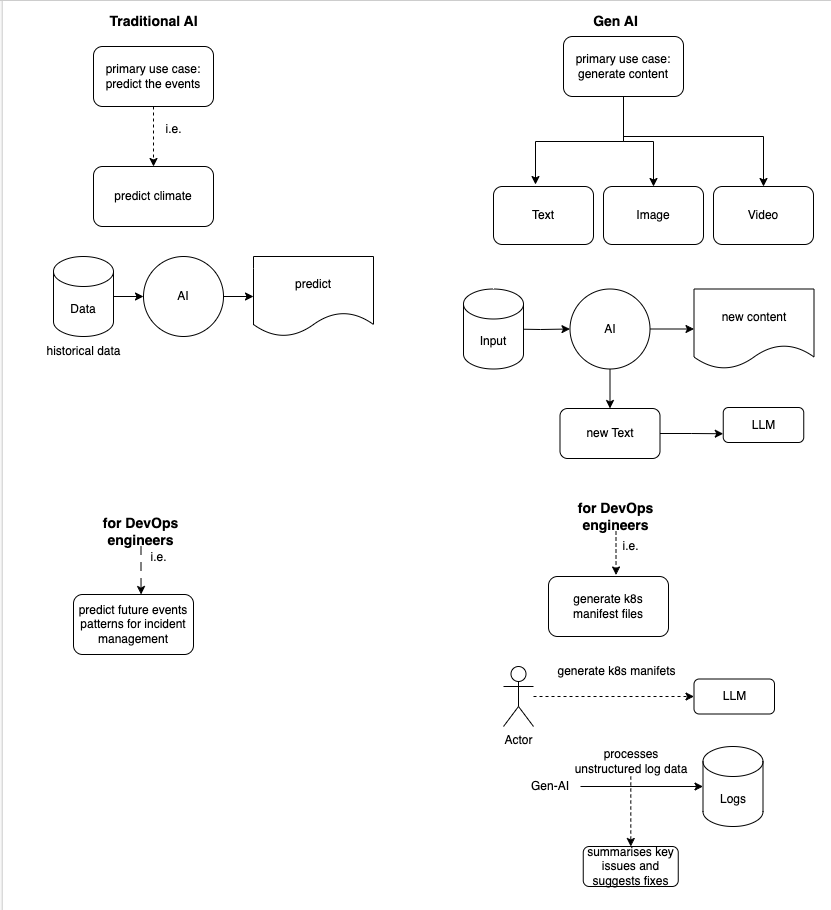

### DAY-1

### DAY-2

#### Prompt Engineering

- prompt -> LLM -> output 
  - How efficiently you provided the prompt, you get the output of the LLM that efficient.
  - The quality of an LLM’s output depends on how well you craft the prompt.

#### Prompt Types

| Prompt Type           | Description                                               | Example                                                    |
|-----------------------|-----------------------------------------------------------|------------------------------------------------------------|
| Zero-shot prompting   | No examples, just ask directly                            | "Translate this into German: 'Good morning'"               |
| Few-shot prompting    | Provide a few examples to guide the model                 | "'Hello → Hallo', 'Thanks → Danke', 'Goodbye → ?'"         |
| Chain-of-thought      | Ask the model to reason step by step                      | "What’s 15 + 27? Let’s think step by step."                |
| Instruction-based     | Clear task description in natural language                | "Summarize this text in one sentence."                     |

#### Benefits

- Good prompts significantly reduce the cost for the organisations.
  - Good and bad prompts affect cost in LLMs because clearer, more efficient prompts reduce the number of tokens and retries needed, directly lowering usage and compute expenses.

### References

(1*) [DAY-1 | Fundamentals of AI Assisted DevOps | Demo and Notes Included](https://www.youtube.com/watch?v=ej3cJBMG_8s&list=PLdpzxOOAlwvJ_qWyuqhbHteY84O1qr72a&index=2)

(2*) [DAY-2 | Prompt Engineering](https://www.youtube.com/watch?v=jTW4QPE4ARc&t=10s)